# Order & Inventory Management System

A production-style order & inventory platform: **Spring Boot 4 REST API** with transactional consistency, optimistic locking and event-driven architecture (Kafka + Outbox Pattern), fronted by an **Angular 21 dark operations console** with JWT auth and role-based views.


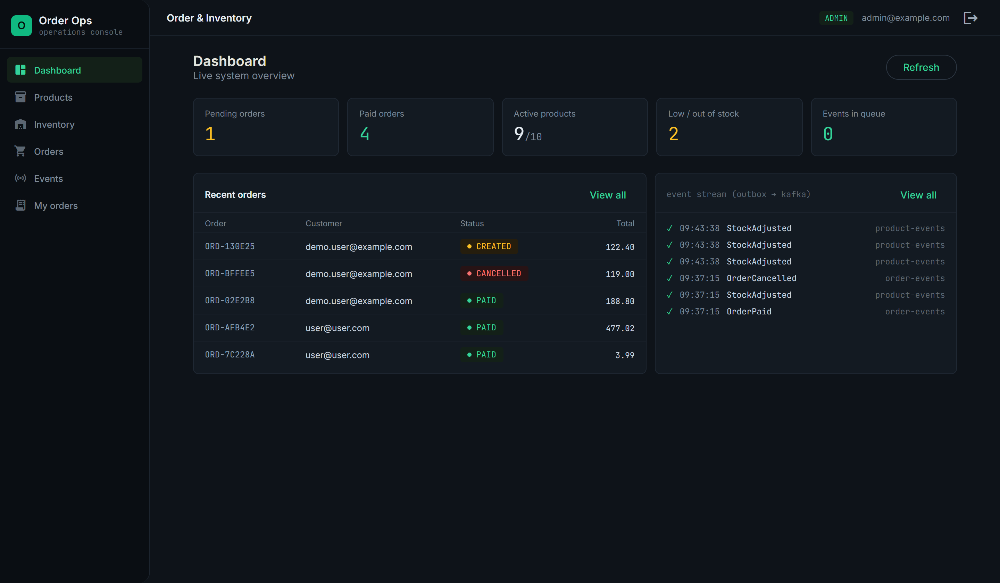

## Table of Contents

- [Screenshots](#-screenshots)
- [Key Features](#-key-features)
- [Architecture](#-architecture)
- [Order Flow](#-order-flow)
- [Outbox Pattern & Kafka](#-outbox-pattern--kafka)
- [Security](#-security)
- [API Overview](#-api-overview)
- [Concurrency & Consistency](#-concurrency--consistency)
- [Error Handling](#-error-handling)
- [Testing](#-testing)
- [Frontend](#-frontend)
- [Getting Started](#-getting-started)

## 📸 Screenshots

<table>
  <tr>
    <td align="center"><b>Products — catalog CRUD (ADMIN)</b></td>
    <td align="center"><b>Inventory — stock & optimistic-lock version (ADMIN)</b></td>
  </tr>
  <tr>
    <td>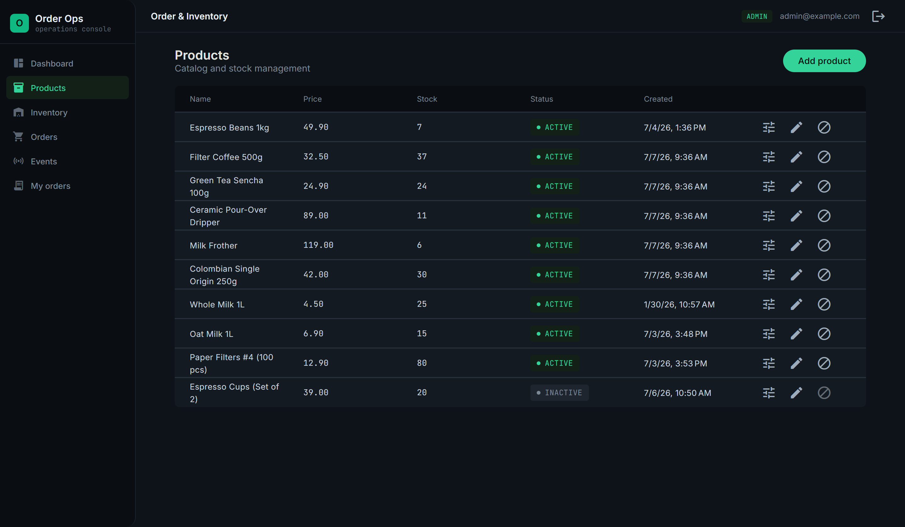</td>
    <td>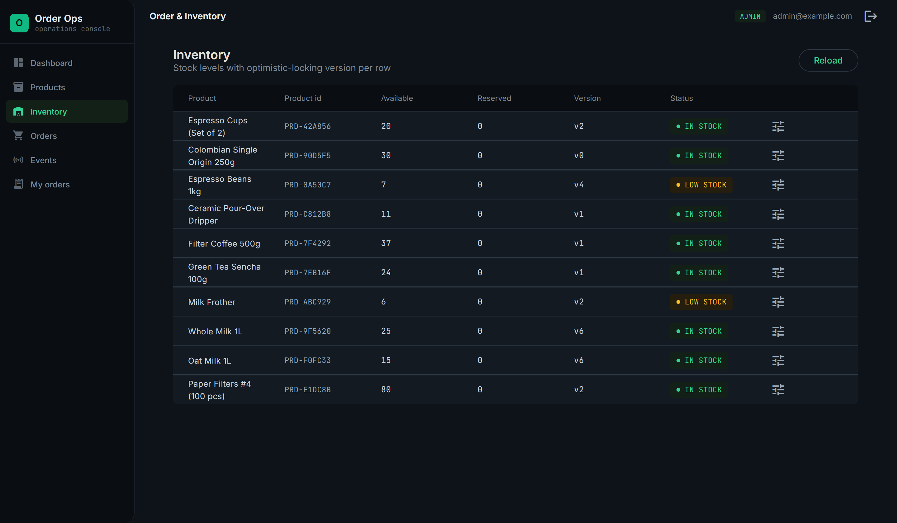</td>
  </tr>
  <tr>
    <td align="center"><b>Outbox events — Kafka publish status (ADMIN)</b></td>
    <td align="center"><b>Sign in / register</b></td>
  </tr>
  <tr>
    <td>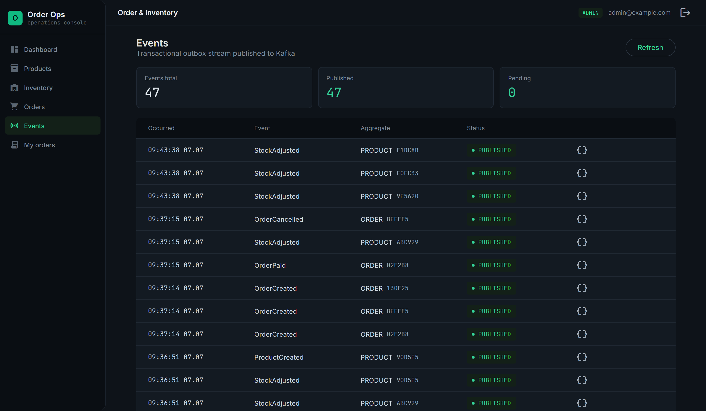</td>
    <td>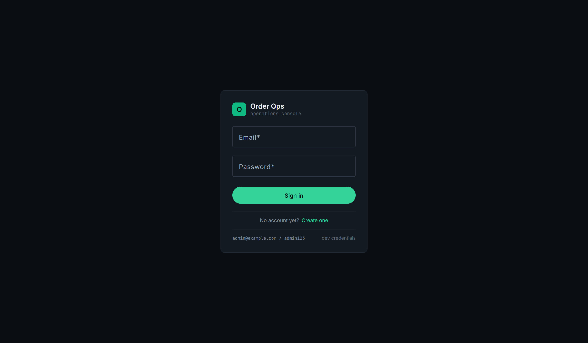</td>
  </tr>
  <tr>
    <td align="center"><b>User dashboard (USER)</b></td>
    <td align="center"><b>Catalog with live stock (USER)</b></td>
  </tr>
  <tr>
    <td>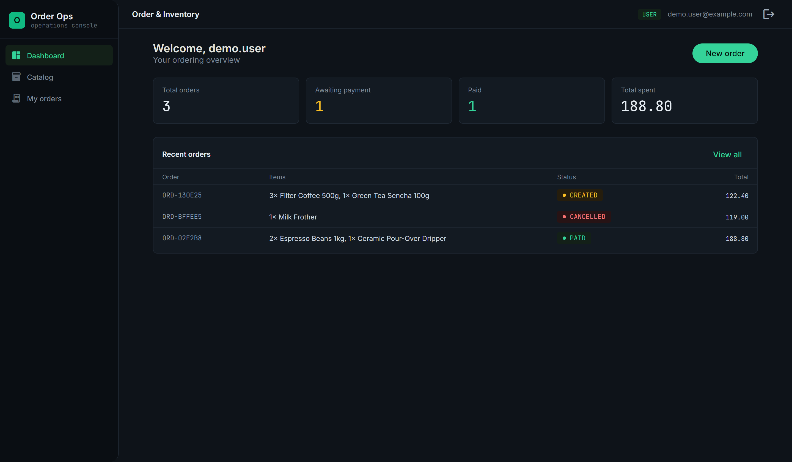</td>
    <td>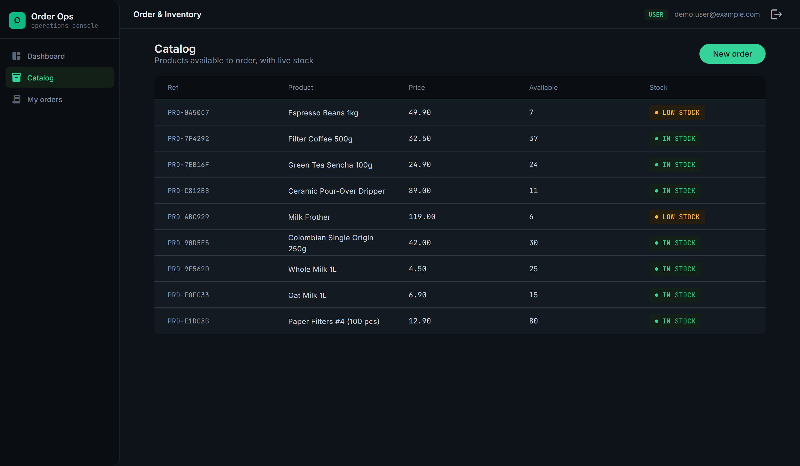</td>
  </tr>
  <tr>
    <td align="center" colspan="2"><b>My orders — pay / cancel own orders (USER)</b></td>
  </tr>
  <tr>
    <td colspan="2">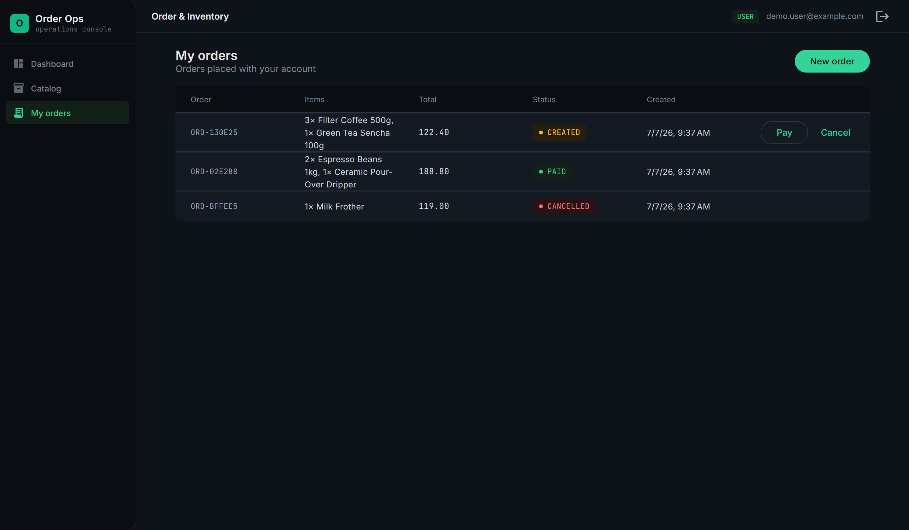</td>
  </tr>
</table>

## ✨ Key Features

- **Order lifecycle** with strict status transitions enforced in the domain model (`CREATED → PAID / CANCELLED`)
- **Inventory consistency** under concurrency via optimistic locking (`@Version`)
- **Transactional Outbox Pattern** — domain events persisted atomically with business data, published to Kafka by a background job (no lost events)
- **JWT authentication** with `ADMIN` / `USER` roles; orders are owned by users
- **Schema migrations** with Flyway (`ddl-auto=validate` — Hibernate never touches the schema)
- **OpenAPI / Swagger UI** documentation
- **Integration tests on real PostgreSQL** via Testcontainers — no in-memory database
- **Angular 21 ops console** — zoneless change detection with signals, Material 3 dark theme, role-aware routing

## 🏗 Architecture

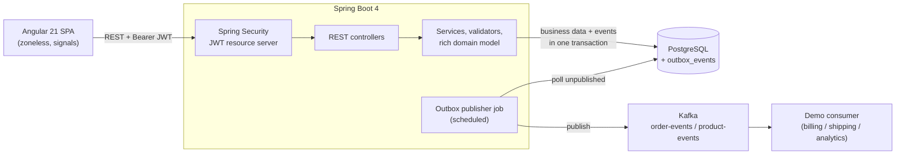

BPMN view of the order request process:

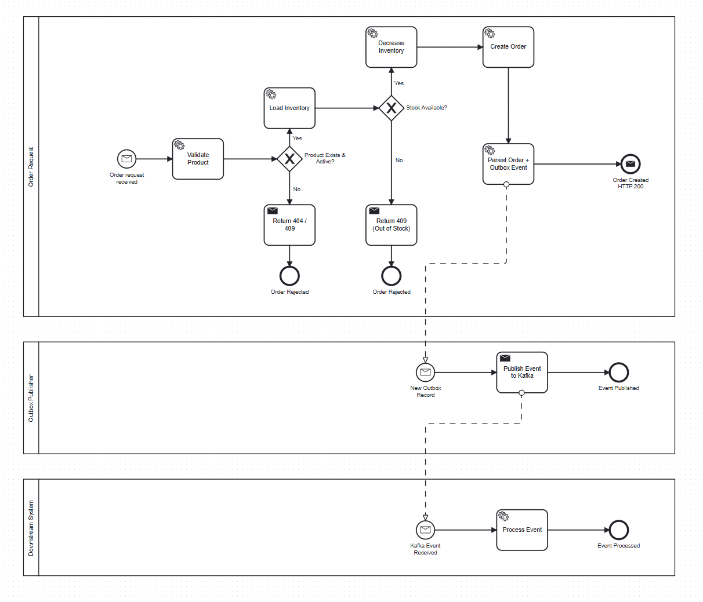

## 🔄 Order Flow

Placing an order runs in a **single transaction**: product validation, stock reservation, order persistence and the outbox event either all succeed or all roll back.

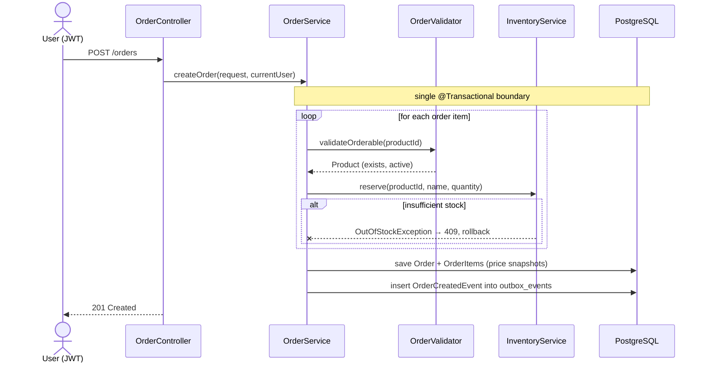

Order status transitions are guarded by the domain model itself (`OrderStatus.canTransitionTo`), not by controller checks:

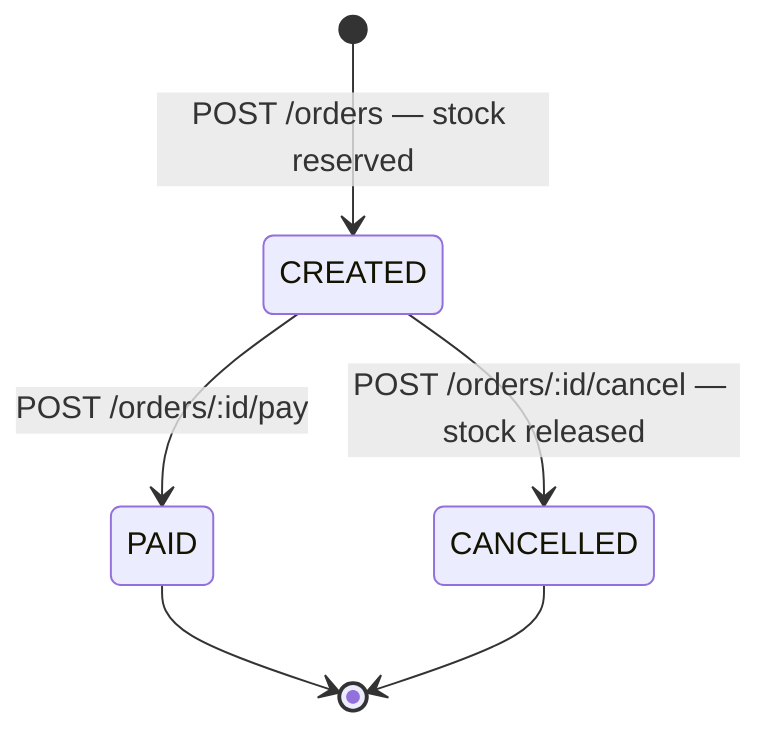

Every transition persists a domain event (`OrderCreated`, `OrderPaid`, `OrderCancelled`) to the outbox in the same transaction. Order items snapshot the product name and unit price at purchase time, so later catalog edits never rewrite history.

## 📣 Outbox Pattern & Kafka

Publishing directly to Kafka inside a database transaction is unsafe — the send can succeed while the transaction rolls back (or vice versa). This project uses the **Transactional Outbox Pattern** instead:

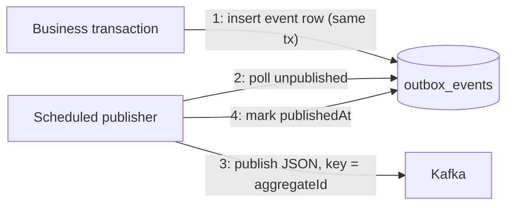

- Events (`id`, `aggregateType`, `aggregateId`, `type`, `payloadJson`, `occurredAt`, `publishedAt`) are stored in the same transaction as the business change — **no lost events**.
- A scheduled job publishes them to `order-events` / `product-events`, using `aggregateId` as the message key (per-aggregate ordering).
- A demo consumer logs received events, standing in for downstream systems (billing, shipping, analytics).
- Kafka is disabled in tests; outbox behavior is asserted directly against the database.

## 🔐 Security

- **JWT (HS256)** issued on login, validated by Spring Security's OAuth2 resource server
- Passwords hashed with **BCrypt**
- Two roles: `ADMIN` (operations console) and `USER` (own orders only)
- **Ownership checks**: a user can read/pay/cancel only their own orders; admins see everything
- Admin account is seeded on startup; regular users register themselves (dev credentials configurable in `application.properties`, override in production)

## 📖 API Overview

Interactive documentation: **Swagger UI** at `http://localhost:8080/swagger-ui.html`.

| Method | Endpoint | Access |
|---|---|---|
| POST | `/auth/register` | public |
| POST | `/auth/login` | public |
| GET | `/users/me` | authenticated |
| GET | `/products` | public |
| POST / PATCH | `/products`, `/products/{id}` | ADMIN |
| POST | `/products/{id}/stock` | ADMIN |
| GET | `/inventory` | ADMIN |
| POST | `/orders` | authenticated |
| GET | `/orders/my` | authenticated |
| GET | `/orders` | ADMIN |
| GET | `/orders/{id}` | owner or ADMIN |
| POST | `/orders/{id}/pay`, `/orders/{id}/cancel` | owner or ADMIN |
| GET | `/outbox-events` | ADMIN |

## 🔒 Concurrency & Consistency

Inventory rows carry a `@Version` column (visible in the Inventory screenshot above). When two customers race for the last item:

- one transaction commits and takes the stock,
- the other fails with **409 Conflict** (optimistic locking) instead of overselling.

This behavior is verified by concurrent integration tests against real PostgreSQL.

## ⚠️ Error Handling

The API returns consistent JSON errors:

```json
{
  "status": 409,
  "message": "Product Espresso Beans 1kg is out of stock for that request: requested = 21, available = 7."
}
```

| Scenario | HTTP |
|---|---|
| Resource not found | 404 |
| Validation error | 400 |
| Invalid order status transition | 400 |
| Out of stock / inactive product | 409 |
| Optimistic locking conflict | 409 |
| Email already registered | 409 |
| Invalid credentials | 401 |
| Accessing someone else's order | 403 |

## 🧪 Testing

- **60 backend tests** — integration-first: real PostgreSQL via **Testcontainers** (singleton container), full HTTP → DB flows, concurrency scenarios, outbox assertions; no in-memory database
- **10 frontend tests** (Vitest) — auth service and HTTP interceptor
- Kafka is disabled in the test context to keep tests fast and deterministic

```bash
./gradlew test          # backend
cd frontend && npm test # frontend
```

## 🖥 Frontend

Angular 21 single-page app in `frontend/`:

- **Zoneless change detection** — all view state modeled with **signals** (`signal`/`computed`), the Angular 21 default
- **Material 3 dark theme** — custom "operations console" look: monospace identifiers, terminal-style status chips, live event-stream panel
- **Role-aware UI** — functional route guards + interceptor; admins get the full console, users get a personal dashboard, read-only catalog and their orders
- Compact references (`ORD-CEA8F9`, `PRD-42A856`) instead of raw UUIDs across all tables

## 🚀 Getting Started

```bash
# 1. infrastructure (PostgreSQL, Kafka)
docker compose up -d

# 2. backend — http://localhost:8080
./gradlew bootRun

# 3. frontend — http://localhost:4200
cd frontend
npm install
npm start
```

Sign in with the seeded admin (`admin@example.com` / `admin123`, dev defaults) or create a `USER` account via the **Create one** link on the sign-in screen. The frontend proxies API calls to `:8080` (`frontend/proxy.conf.json`), so no CORS configuration is needed.
